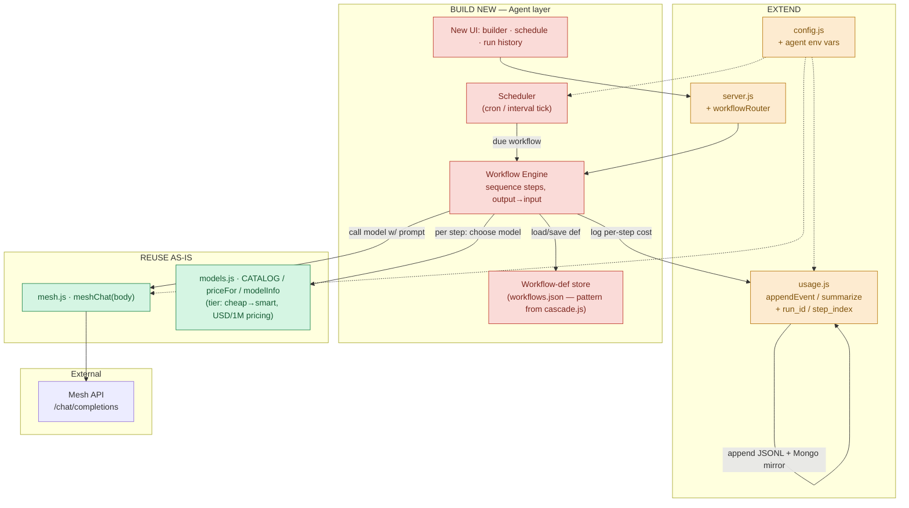

# 04 · Reuse Audit — Brolly → Scheduled Multi-Model Workflow Agent

**Purpose:** Ponytail reuse gate. Before writing any new code for the pivot (proxy+dashboard → *scheduled multi-model workflow agent*, Agents & Automation track), inventory exactly what the existing Brolly backend gives us for free, what needs a small extension, and what must be built from scratch. Also decide what of the old Next.js frontend to keep vs scrap.

**Scope:** This is an **audit only** — no code was changed. All findings verified by direct read of the repo at `/Users/shashi/Documents/projects/brolly` (git root confirmed; latest commit `504ea79`).

**What the new agent needs (the 6 questions this audit answers):**
- (a) call a chosen Mesh model with a prompt
- (b) pick cheap-vs-smart model per step
- (c) log cost per run
- (d) run steps in sequence, passing output → input
- (e) scheduling
- (f) persist workflow definitions + run history

---

## TL;DR verdict

| Need | Verdict | Where |
|---|---|---|
| (a) call a model with a prompt | **REUSE AS-IS** | `mesh.js` → `meshChat(body)` |
| (b) cheap-vs-smart per step | **REUSE the taxonomy** | `models.js` → `CATALOG` (`tier`, `prompt`/`completion` prices), `priceFor`, `modelInfo` |
| (c) log cost per run | **EXTEND** | `usage.js` → `appendEvent` / `summarize` / `priceFor` (add run/step grouping key) |
| (d) sequence steps output→input | **BUILD NEW** | *nothing exists* — `pipeline.js` is single-completion cascade, not a workflow engine |
| (e) scheduling | **BUILD NEW** | *nothing exists* — no cron/timer/scheduler in code or deps |
| (f) persist workflow defs + run history | **BUILD NEW** (borrow patterns) | JSON-file store pattern from `cascade.js`; append-log pattern from `usage.js` |

Frontend: **keep** the shadcn/ui primitives, the doodle brand system, and the thin fetch-wrapper pattern; **scrap** the cascade/failover pages and the "model insurance" narrative copy.

---

## REUSE AS-IS

*File → function → why it fits, unchanged.*

### `backend/src/mesh.js` → `meshChat(body)` (mesh.js:10–18)
The single Mesh integration point and the exact primitive a workflow step needs: "call a chosen model with a prompt." It is already generic — it takes an arbitrary OpenAI-shaped `body` (`{ model, messages, ... }`), POSTs to `${MESH_BASE_URL}/chat/completions` with `Authorization: Bearer <key>`, forces `stream:false`, and returns `{ ok, status, data }` where `data.choices[0].message.content` is the model output and `data.usage.{prompt_tokens,completion_tokens}` is the cost basis. A workflow step is literally `await meshChat({ model: step.model, messages: [{ role: 'user', content: renderedPrompt }] })`. **No change required.**

- `meshChatStream(body)` (mesh.js:20–27) — returns the raw streaming `Response`; not needed for a batch/scheduled agent, but available if we ever want live step output.
- `meshModels()` (mesh.js:29–36) — GET `/models`; useful later to hydrate `CATALOG` with live pricing (see the `ponytail:` note at models.js:1), not required for v1.

### `backend/src/models.js` → `CATALOG`, `priceFor(id)`, `modelInfo(id)` (models.js:3–24)
The cheap-vs-smart taxonomy is exactly what per-step model selection needs, as-is:
- `CATALOG` entries carry `{ id, family, tier, prompt, completion }` where **`tier` 1 = cheap, 2 = mid, 3 = smart** and `prompt`/`completion` are USD-per-1M-token prices (models.js:4–12). A workflow step definition can reference a model by `id`, or a UI can offer "cheap / mid / smart" and resolve to a `tier`-filtered `id`.
- `priceFor(id)` (models.js:17–20) returns `{ prompt, completion }` with a `DEFAULT_PRICE` fallback — directly reusable to cost a step.
- `modelInfo(id)` (models.js:22–24) returns the full catalog entry or `null`.

**No change required** for the pivot. (Optional later: live-hydrate prices via `meshModels()`.)

### Cost formula inside `backend/src/usage.js` → `summarize()` (usage.js:77–80)
The per-event cost math — `(prompt_tokens/1e6)*price.prompt + (completion_tokens/1e6)*price.completion` — is correct and reusable verbatim to compute cost per step and per run. (The *aggregation* around it needs extension; see below.)

---

## EXTEND

*Exists and is close, but needs a small addition for the workflow shape.*

### `backend/src/usage.js` — cost logging → run/step history
`usage.js` already gives us durable, append-only cost logging with a Mongo mirror:
- `appendEvent(event)` (usage.js:33–40) writes one JSON line to `backend/data/usage.jsonl` (`USAGE_FILE`, usage.js:10) and best-effort mirrors into MongoDB collection `brolly.usage_events` when `MONGO_URL` is set (fire-and-forget, errors swallowed at usage.js:38).
- `readEvents()` (usage.js:42–56) parses the JSONL back (tolerant of malformed lines).
- `summarize(events)` (usage.js:58–98) rolls events into `{model, day}` buckets with `est_cost_usd`, plus a 10-minute `burnRate`.

**Gap:** every event today is a *flat single completion* — fields are `ts, model, prompt_tokens, completion_tokens, latency_ms, stream, ok, cascade_step, session_id, reason` (see the event written at pipeline.js:35–46). There is **no notion of a "run" or a "workflow."**

**Extension needed (small):** add grouping keys to the event — e.g. `workflow_id`, `run_id`, `step_index` — and add a `summarizeByRun(events)` companion to `summarize()` that buckets by `run_id` instead of `{model, day}`. The write path (`appendEvent`), storage (JSONL + Mongo mirror), and cost math all carry over unchanged; only the event schema and one aggregation function grow. This makes `usage.jsonl` double as run history for free.

### `backend/src/config.js` — env surface
`config.js` (config.js:1–8) is the single env-loading module (`MESH_API_KEY`, `MESH_BASE_URL`, `PORT`, `MOCK`, `MONGO_URL`, `DEGRADE_ON_SPEND_LIMIT`). **Extend** with the new agent's config (e.g. `WORKFLOW_DATA_FILE`, scheduler tick interval, `MAX_CONCURRENT_RUNS`) following the same `process.env.X || default` pattern. Trivial.

### `backend/src/server.js` — HTTP surface
Express app with routes registered at server.js:24–25 (`cascadeRouter`, `failoverRouter`), plus `POST /v1/chat/completions` (server.js:57), `GET /v1/models` (server.js:127), `GET /api/usage/summary` (server.js:162), `GET /api/usage/events` (server.js:166), `GET /api/health` (server.js:173), and a JSON error handler (server.js:177). **Extend** by mounting a new `workflowRouter` (`POST /api/workflows`, `GET /api/workflows`, `POST /api/workflows/:id/run`, `GET /api/runs`, etc.) alongside the existing routers — the plumbing (JSON body limit, error middleware, router-mounting convention) is ready to host it.

---

## BUILD NEW

*No usable precedent — must be written. The primitives above (esp. `meshChat`, `CATALOG`, `appendEvent`) are the building blocks.*

### 1. Workflow engine — sequence steps, output → input  ⚠ **the core gap**
**Nothing in the repo chains distinct steps.** The named `pipeline.js` `completeChat(body)` (pipeline.js:21–67) is **NOT** a multi-step workflow orchestrator — it loops over `candidates` (pipeline.js:24–25), which are *alternative models for the same single prompt* produced by `pickCandidates` (cascade) and, on final failure, one `pickFallback` (failover). It escalates one logical chat completion across models; it never takes step N's output and feeds it into step N+1's prompt. Confirmed by full read of all 67 lines.

So the workflow engine is genuinely new: define an ordered list of steps, each `{ model (or tier), prompt template referencing prior outputs }`; execute sequentially; interpolate previous step outputs into the next step's prompt; call `meshChat` per step (pipeline.js:10–19 `callModel` is a decent reference for the mock/degrade wrapper, but its cascade loop is not what we want); record a per-step usage event.

### 2. Scheduler
**Confirmed absent** — no cron, `setInterval` job runner, timers, or scheduling library anywhere (verified in source and in `backend/package.json`, whose only deps are `express` and `mongodb` — no `node-cron`/`agenda`/`bull`/`bree`). Build a scheduler that stores per-workflow cron/interval and triggers runs. (Ponytail-minimal option: `node-cron`, or a single `setInterval` tick that scans due workflows — the app is a single-instance Express process, so an in-process timer is the lazy path.)

### 3. Workflow-definition store + run-history store
**No workflow/run schema exists.** Two reusable *patterns* to borrow rather than invent:
- **Definition store** — copy the JSON-file pattern from `cascade.js`: `load()`/`save()` (cascade.js:24–40) read/write a single JSON file at `DATA_FILE` (overridable via env `CASCADE_DATA_FILE`, cascade.js:9) with `mkdirSync` + `writeFileSync`. A `workflows.json` store for definitions is the same shape.
- **Run history** — reuse the `usage.js` append-log + Mongo-mirror pattern (see EXTEND above); `usage.jsonl` grouped by `run_id` is the run history.

> Note (failover.js:6, `ponytail:` comment): the failover session store is **in-memory `Map`/`Set` only** — "ceiling is process-restart data loss and single-instance scale." Do **not** model workflow persistence on that; use the file/Mongo pattern so runs survive a restart.

### 4. New UI (agent-facing)
Build: a workflow **builder** (ordered steps, per-step model/tier + prompt template), a **schedule** editor (cron/interval), and a **run history** view (per-run steps, per-step cost, total cost, status). None of these exist today. Reuse the frontend primitives and brand system called out below; do not reuse the cascade/failover page trees.

---

## SCRAP

*Old proxy/"model insurance" concept surface with no analog in a scheduled-workflow product.*

- **`frontend/app/cascade/page.tsx`** + `frontend/components/cascade/*` — cascade ladder/benchmark UI. No "cascade" concept in a workflow agent. **Scrap.** *(Note: this file is currently modified in the working tree — unrelated to this audit; leave it untouched.)*
- **`frontend/app/failover/page.tsx`** + `frontend/components/failover/*` — kill-switch / "the wire" session viz. No analog. **Scrap.**
- **`frontend/app/dashboard/page.tsx`** — burn-rate "weather station" spend dashboard tied to the proxy's per-model ledger. The *metaphor/logic* scraps; the visual shell could be repurposed for run-history if the weather framing is dropped.
- **Landing narrative copy** — `frontend/app/page.tsx` and its sections (`hero.tsx`, `flipbook-story.tsx`, `receipts.tsx`, `how-it-works.tsx`): all copy is bound to the umbrella/rain/"model insurance" story, not "scheduled agent workflows." **Rewrite/scrap the copy** (visual language can stay).
- **`frontend/components/*/use-weekly-budget.ts`** — local-storage weekly-budget state; budget-vs-workflow-run doesn't map cleanly. **Scrap.**
- Backend cosmetic: `backend/package.json` `name` is still `"model-insurance-backend"` — rename when convenient (non-blocking).

**Backend to keep running untouched during the pivot:** `cascade.js` and `failover.js` are self-contained routers (mounted at server.js:24–25); they can stay mounted or be unmounted later — they don't block the new workflow router and are not on its critical path.

---

## Reused-backend + new-agent-layer diagram

---

## Frontend: keep vs scrap detail

**Keep (reusable regardless of pivot):**
- **shadcn/ui primitives** — `frontend/components/ui/`: `badge, button, card, dialog, field, input, label, select, separator, skeleton, switch, table, tabs, tooltip` (14 components; `components.json` style `base-nova`, base color `neutral`, icons `lucide`). Fully generic.
- **Doodle brand system** — `frontend/public/brand/` SVGs (`brolly-logo.svg`, ~15 icons, ~14 scenes) with React wrappers `frontend/components/brand/{icons.tsx, logo.tsx, scenes.tsx}`; fonts Gochi Hand + Nunito + JetBrains Mono via `next/font/google` in `layout.tsx`; color tokens in `globals.css`. Cohesive, polished identity worth preserving. (The umbrella/rain *theme* is tied to "model insurance" and may want reinterpretation for the Agents & Automation framing.)
- **Generic UI hooks** — `use-viewport-fit.ts`, `use-count-up.ts`, `use-stagger-reveal.ts` (pure UI mechanics).
- **Thin fetch-wrapper pattern** — base-URL-from-`NEXT_PUBLIC_API_URL` + typed response (seen in `components/usage/types.ts`, `components/failover/api.ts`, `components/cascade/types.ts`). The *pattern* transfers; every endpoint path/shape is proxy-specific and gets replaced.

**Scrap:** cascade/failover pages + component trees; landing "model insurance" copy; `use-weekly-budget.ts`; dashboard's weather/burn-rate logic (visual shell optionally salvageable).

**Frontend stack note:** `frontend/package.json` is Next.js **16.2.10 (bleeding-edge)**, React 19, Tailwind 4 — `frontend/AGENTS.md` warns this is not the Next.js you know (breaking changes). Factor that risk into any new-UI work.

---

## Deployment shape (for context)

- `docker-compose.yml` — 3 services: **`mongo`** (`mongo:7`, `27017`, volume `brolly-mongo`), **`backend`** (builds `./backend`, `4001:4000`, **`MOCK: "1"` hardcoded**, `MONGO_URL: mongodb://mongo:27017/brolly`), **`frontend`** (`3001:3000`, `NEXT_PUBLIC_API_URL: http://localhost:4001`).
- `backend/Dockerfile` — `node:22-alpine`, `npm ci --omit=dev`, `EXPOSE 4000`, `CMD node src/server.js`.
- Mongo is present but is a **write-only mirror** (usage.js:16); read path is local JSONL. Fine for the pivot; the new run-history store can lean on the same mirror.

---

## Test coverage (spec evidence — 78 tests, all passing)

`node --test` runner (`backend/package.json` script `"test": "node --test"`), **78 tests / 78 pass** across 7 files:
`test/smoke.test.js`, `test/cascade.test.js`, `test/failover.test.js`, `test/units.test.js`, `test/contract.test.js`, `test/integration.test.js`, `test/security.test.js`. `backend/test/COVERAGE.md` is a genuine per-function spec map — notably it records that **`mesh.js` has zero live-mode coverage** (all tests run `MOCK=1`), and that `pipeline.js` `completeChat` is only black-box tested. `test/integration.test.js` blocks `(a)` cascade / `(b)` kill→failover / `(c)` revive / `(d)` usage growth read as acceptance criteria for the *existing* behavior. Any workflow-engine code we add ships without existing tests and needs its own.

---

## Discrepancies / stop-condition flags

1. **`pipeline.js` is not a workflow orchestrator** — it is single-completion cascade+failover across alternative models for one prompt (pipeline.js:24–61). Zero output→input step chaining anywhere. **This is the single biggest build-new item.** (The brief anticipated this; confirmed true.)
2. **No scheduling code exists** — absent from source and from deps (`express`, `mongodb` only). Matches expectation.
3. **No workflow-def / run-history schema exists** — `usage.jsonl` is flat per-completion; `cascade.json` is the only persisted "config" precedent. Both are patterns to borrow, not schemas to reuse.
4. **Docker Compose forces `MOCK: "1"`** for the backend service (docker-compose.yml), which **contradicts** local `.env` (`MOCK=0`, live `MESH_API_KEY` present, 30-char key — value not printed). A `docker compose up` demo would silently run canned responses unless changed. Live Mesh is active only for local `npm run dev`.
5. **`backend/package.json` name is `"model-insurance-backend"`** — cosmetic confirmation the DNA is proxy/insurance, not workflows.
6. All modules named in the brief (`mesh.js, models.js, usage.js, pipeline.js, cascade.js, failover.js, config.js, server.js, mock.js`) **exist exactly as named** — no missing/renamed files. The only surprise is `pipeline.js`'s *scope* (item 1).
